# **Real-Time Fall Detection on ESP32-S3 using Edge Impulse**

*A practical, fully working wearable built with two custom devices (wrist + foot).*


## **Edge Impulse project links**
- Wrist project: [https://studio.edgeimpulse.com/public/788227/live](https://studio.edgeimpulse.com/public/788227/live)
- Foot project:  [https://studio.edgeimpulse.com/public/788229/live](https://studio.edgeimpulse.com/public/788229/live)

---

## **What this project is**

This project builds a **complete fall-detection system** using:

* 2× **ESP32-S3** devices with **QMI8658 IMUs**
* **Custom 3D-printed enclosures**
* A **dataset recorded from 13 volunteers**
* A **TinyML model trained in Edge Impulse**
* A **touchscreen UI** + **alert workflow**

Everything runs **fully on-device**, no cloud required.

**ESP32-S3-Touch-LCD-1.69**
* Link: [https://www.waveshare.com/wiki/ESP32-S3-LCD-1.69](https://www.waveshare.com/wiki/ESP32-S3-LCD-1.69)
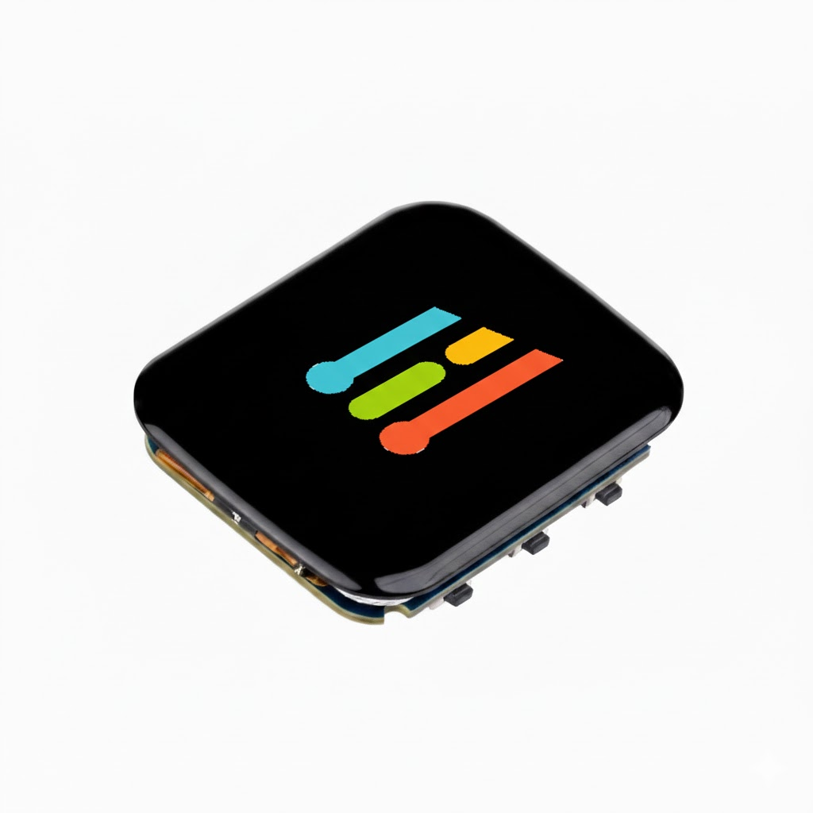


---

## **Hardware Setup**

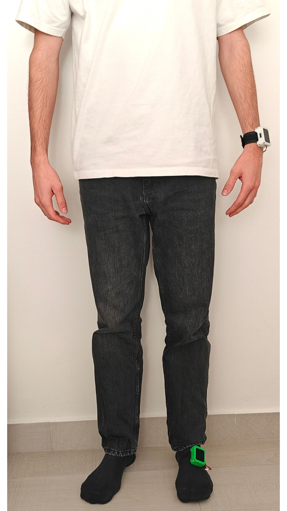

Each wearable includes:

* ESP32-S3 DevKit
* QMI8658 6-axis IMU
* Li-Po battery
* Strap (wrist / foot)
* Touchscreen for alerts

**Why two devices?**
To compare **wrist** vs **foot** detection performance.

**Wrist device**

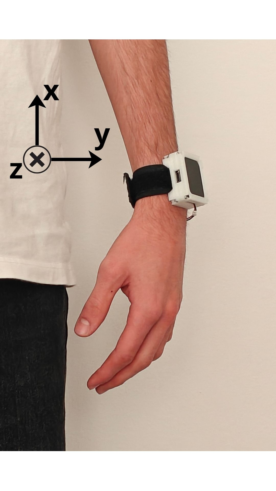

**Foot device**

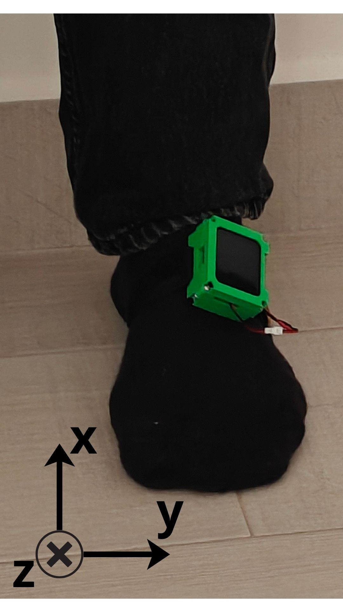

---

## **Dataset (hands-on, what we collected)**

We recorded data from 13 volunteers on a safe tatami area, with each participant contributing approximately 18.5 minutes of data. Recordings consisted of short activities lasting 10–30 seconds, including about 8.5 minutes of fall simulations and 10 minutes of daily activities (ADLs) per volunteer.

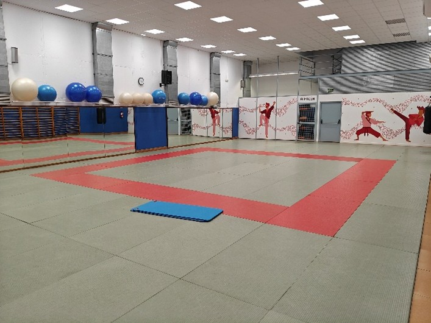

* **33 activity types**

  * 17 ADLs (Activities of Daily Living): walking, stairs, jogging, sitting/standing, stumbling…
  * 16 Falls: forward, backward, lateral, slips, trips, collapse…

* **File naming convention:**
Each file follows the naming pattern `Axx_Dyy_zz.csv` / `Axx_Fyy_zz.csv`: Axx = volunteer, D/F = activity type, yy = task number, zz = repetition.

Rough stats:

* 2,470 CSV files
* 8+ hours of IMU data
* 50 Hz sampling
* BLE live capture via Python script

**Note on A01 and A02:**
*Due to transmission and formatting inconsistencies in the recordings from volunteers A01 and A02, their data could not be aligned with the final dataset structure and were excluded to maintain consistency across all subjects.*

* **Participant statistics**

| Metric        | Age (years) | Height (cm) | Weight (kg) |
|--------------|-------------|-------------|-------------|
| Mean         | **31.1**    | **175.0**    | **69.0**    |
| Mode         | 23          | 183         | 78          |
| Maximum      | 54          | 187         | 89          |
| Minimum      | 19          | 163         | 52          |

**Dataset's CSV file**

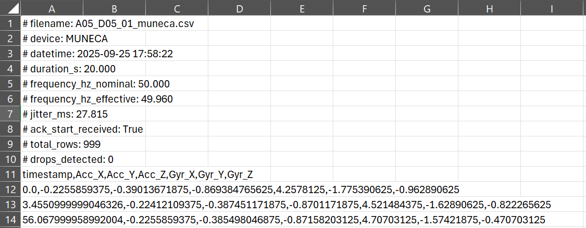

**Data collection workflow**

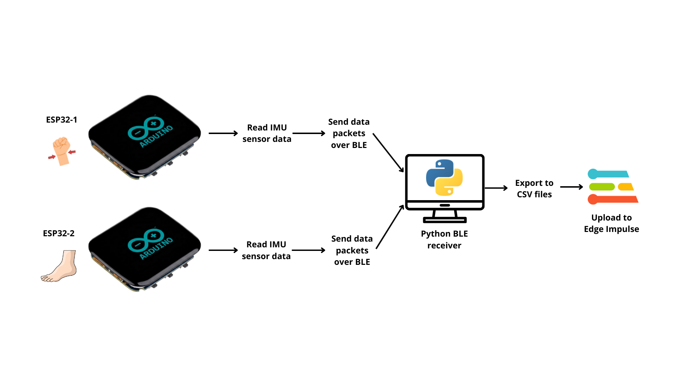

---

## **How the model was built**

### **Pipeline (super simple):**

1. Upload CSVs to Edge Impulse
2. Generate windows (10-second sliding windows)
3. Extract **Spectral Features**
4. Train a **small Dense Neural Network**
5. Export the **C++ library** for ESP32-S3


### **Why this works well**

* Falls create strong, unique acceleration patterns
* Spectral features capture them cleanly
* The NN is tiny → runs easily on microcontrollers

## Edge Impulse full pipeline (feature extraction, model and validation)
The model receives 10-second windows of 3-axis accelerometer data, converts them into spectral features, and runs a compact 3-layer dense neural network. This produces a FALL/ADL probability that is then post-processed on the ESP32-S3 using EMA smoothing and a state machine to ensure reliable, low-false-positive detection.

### 1. Windowing & segmentation

All recordings (ADLs and falls) are converted into fixed-length windows before entering the ML pipeline:

* **Window length:** 10 seconds (≈ 500 samples at 50 Hz).
* **Overlap:** **25%** between consecutive windows.
* **Channels:** 3-axis **accelerometer only**.

Using relatively long windows guarantees that each fall window contains the **full episode** (pre-impact, impact and early recovery), while the **25% overlap** avoids gaps in the timeline without exploding the number of training samples. This is a pragmatic compromise between temporal resolution, dataset size and training time.

> **Why only accelerometer?**
> During early experiments the gyroscope suffered from a configuration issue that produced **systematic saturation during impacts**, generating flat-topped plateaus in the angular-velocity signals. These artefacts degraded model performance and made gyroscope readings less trustworthy, so the final pipeline focuses on the accelerometer, which remained stable and sufficient to separate falls from ADLs.

**Gyroscope saturation example**

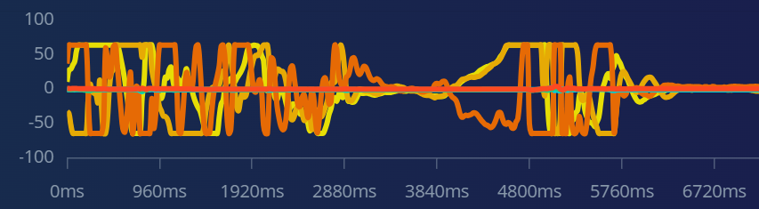

---

### 2. Feature extraction – Spectral Features

For each 10-second window we use Edge Impulse’s **Spectral Features** block configured as:

* Filter: **none** (scale axes = 1, decimation ratio = 1).
* Analysis type: **FFT**.
* **FFT length:** 64.
* Log spectrum: **enabled**.
* Overlap FFT frames: **enabled**.
* Improve low-frequency resolution: **enabled**.
* Feature normalization: **“Normalize using scikit-learn’s”** (standard scaling across features).

This block converts each accelerometer axis into a compact representation of its **frequency content**, capturing how energy is distributed across frequencies over the 10-second window.

**Why Spectral Features and not raw time-domain windows?**

* Falls are characterised by **short, high-energy bursts** and changes in oscillation patterns that are very visible in the frequency domain.
* The FFT compresses long time windows into a **small, fixed-size feature vector**, ideal for a TinyML classifier.
* Working with spectral magnitudes (and their logarithm) makes the features **less sensitive to small timing shifts** within the window, which is useful when fall onsets are not perfectly aligned.
* It avoids the need for more complex architectures (e.g. 1D-CNNs or RNNs) to learn temporal filters from raw samples, keeping the model smaller and faster.

This design keeps the pipeline simple: **one well-understood feature block + one small dense network**.

**Spectral Features – configuration screenshot:**

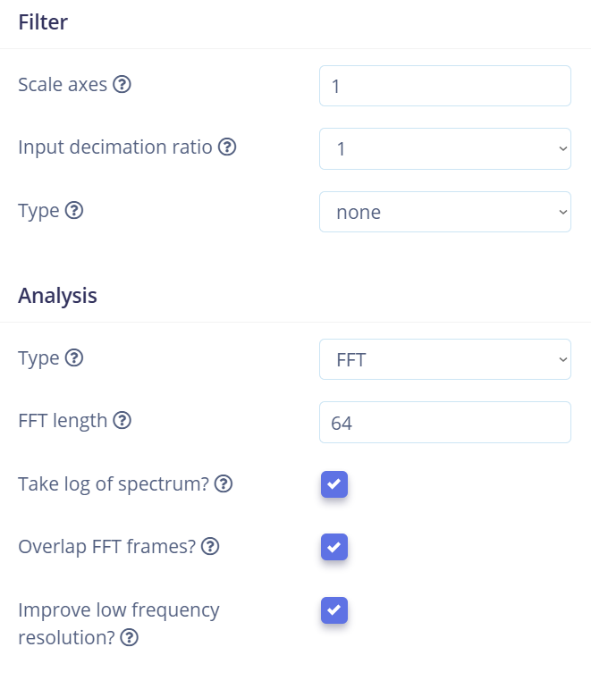

---

### 3. Neural network architecture (classifier)

On top of the spectral features we use a **fully connected neural network** with three hidden layers:

* **Input layer:** spectral features from the 3 accelerometer axes for a 10-second window.
* **Hidden layer 1:** Dense(64), activation **ReLU**, L1 activity regularization (`1e-5`).
* **Hidden layer 2:** Dense(32), activation **ReLU**, L1 regularization.
* **Hidden layer 3:** Dense(16), activation **ReLU**, L1 regularization.
* **Output layer:** Dense(2), activation **Softmax** → classes `{ADL, FALL}`.

**Classifier – configuration screenshot:**

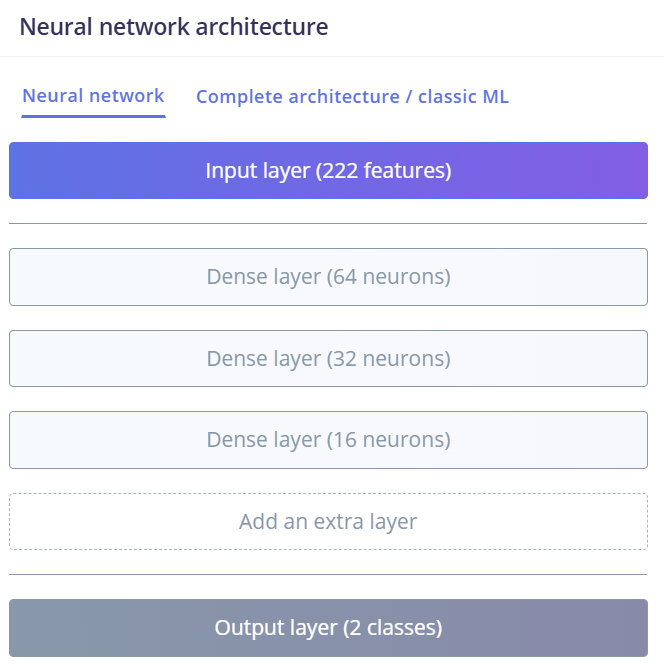

**Why this architecture and not something larger or more complex?**

* Three dense layers give a good **balance between capacity and size**: enough depth to learn non-linear decision boundaries between diverse ADLs and falls, but still very compact for deployment.
* Dense layers work well because the Spectral Features block already captures the relevant structure; we do not need convolutions or recurrent layers to extract local patterns.
* L1 regularization encourages **sparse activations and smaller weights**, which reduces overfitting and is friendly for TinyML.
* The Softmax output makes the model interpretable on-device, providing a clear **probability of FALL vs ADL**.

In practice this architecture is a good compromise between:

* **Learning capacity** (rich enough to separate classes).
* **Model size** (small enough for microcontroller Flash/RAM).
* **Latency** (fast inference so that real-time fall detection is possible).

---

### 4. Hyperparameters & optimization

Training is done directly in Edge Impulse (TensorFlow backend) with the following key hyperparameters:

* **Epochs:** 50
* **Learning rate:** 0.0005 (Adam optimizer)
* **Batch size:** 32
* **Loss:** categorical cross-entropy
* **Optimizer:** Adam (`beta1 = 0.9`, `beta2 = 0.999`)
* **Train/validation split:** 80 / 20 % (inside the training set of each LOSO fold)
* **Auto-weight classes:** enabled
* **Feature normalization:** scikit-learn StandardScaler

**Why these choices?**

* 50 epochs and a relatively low learning rate (0.0005) give the network enough time to converge smoothly without overshooting, which is important with small datasets and regularization.
* Batch size 32 is a good compromise between gradient stability and training time.
* **Auto-weight classes** compensates for the natural imbalance between ADL and FALL windows: ADLs generate more windows due to longer duration, so weighting avoids the model simply “preferring” ADL.
* StandardScaler normalization keeps all features on a comparable scale, which helps both convergence and numerical stability.

These settings are simple but robust and easy to reproduce for anyone extending the project.

---

### 5. TinyML profile – memory and latency

Edge Impulse’s **int8 model profiling** (enabled in the training settings) reports the resource usage of the quantized model on the target MCU.

### TinyML profiling (Edge Impulse int8 model)

| Target MCU | Total Flash | Total RAM | Total latency |
|------------|-------------|-----------|----------------|
| ESP32-S3   | **31.1 kB** | **9.3 kB** | **52 ms**      |

These numbers show that the model:

* Fits comfortably within the ESP32-S3 Flash and RAM budgets.
* Runs in **well under the 10-second window duration**, leaving enough CPU headroom for other tasks.

---

### 6. Validation strategy – Leave-One-Subject-Out (LOSO)

Human-activity datasets are very prone to **data leakage** if windows from the same person are mixed between train and test sets. Even if windows are shuffled, the model can implicitly learn subject-specific patterns (gait, speed, body shape), leading to **over-optimistic accuracy** that does not generalize to new users.

To avoid this, we use a **Leave-One-Subject-Out (LOSO)** validation scheme:

1. For each fold, we **exclude one volunteer entirely** from training.
2. The model is trained on the remaining subjects and **tested only on the held-out subject**.
3. This is repeated so that every subject acts once as an unseen test user.
4. Final metrics are averaged across all folds.

This strategy deliberately makes the problem **harder**:

* Reported accuracies are typically **lower** than with a random train/test split, because the model cannot rely on subject-specific details.
* However, the resulting numbers are much closer to the **real behaviour** we expect when deploying the detector to new users.

In our case, LOSO shows that:

* The **wrist model** reaches around **98% accuracy with ~100% FALL recall** on unseen subjects.
* The **foot model** stays around **96% accuracy with ~94% FALL recall**, still very competitive for use cases like smart insoles.

By explicitly adopting LOSO and documenting it, we aim to provide **realistic, user-independent performance estimates**, rather than inflated metrics that would be hard to reproduce outside the lab.

### Wrist model – Confusion matrix and metrics

| True \ Predicted | **ADL** | **FALL** | **UNCERTAIN** |
|------------------|---------|----------|----------------|
| **ADL**          | **97.8%** | 2.2%    | 0%            |
| **FALL**         | 0%      | **100%** | 0%            |

**Area under ROC Curve:** 0.99  
**Weighted precision:** 0.99  
**Weighted recall:** 0.99  
**Weighted F1 score:** 0.99  


### Foot model – Confusion matrix and metrics

| True \ Predicted | **ADL** | **FALL** | **UNCERTAIN** |
|------------------|---------|----------|----------------|
| **ADL**          | **97.8%** | 1.1%    | 1.1%          |
| **FALL**         | 5.8%    | **94.2%** | 0%            |

**Area under ROC Curve:** 0.96  
**Weighted precision:** 0.96  
**Weighted recall:** 0.97  
**Weighted F1 score:** 0.96  

**Both placements work**, wrist works slightly better.
But foot is super interesting for **smart insoles** or patients who won’t wear a wrist wearable.

---

## **Model Deployment - On-Device Detection Logic**

The ESP32-S3 does not just run the Edge Impulse model; it also implements a small decision layer that turns raw probabilities into something a caregiver could actually trust.

### 1. Live IMU sampling and sliding window

The QMI8658 accelerometer is configured at **±4 g** and sampled at high rate, then converted to **m/s²** and decimated to match the **50 Hz** training frequency.
Each new sample is clipped to ±4 g, converted to m/s² and pushed into a **sliding buffer of 497 samples × 3 axes**, the same window length used in Edge Impulse. When the buffer is full, the oldest samples are shifted out and a new inference window is ready.

To save energy, the firmware uses an **adaptive inference rate**:

* In normal conditions it runs roughly **8 inferences every 10 seconds**.
* When a potential fall is detected it increases to **≈10 inferences every 10 seconds**, so decisions around the impact are taken faster without keeping the MCU at full load all the time.

### 2. From raw probabilities to a stable signal (EMA & “quietness”)

Each call to `run_classifier()` returns the class probabilities; we keep:

* `p(FALL)` – instantaneous fall probability for the current 10 s window.

This value is very reactive but also noisy, so we compute an **Exponential Moving Average (EMA)**:

```c
fall_ema = α * p_fall_current + (1.0f - α) * fall_ema_previous;   // α = 0.25
```

* `p_fall_current` represents what the model “thinks” right now.
* `fall_ema` behaves like a smoothed confidence level, integrating evidence over several windows.

**Why use an EMA?**

In real movement you can easily get short spikes (e.g., a strong arm swing or a jump) that look like a fall in a single window. Triggering an alarm on every spike would be unusable. The EMA keeps the detector **responsive** (it reacts in a few windows) but demands that the evidence **stays high for a short period** before arming a fall, which greatly reduces false positives.

In parallel, the firmware computes the **standard deviation of the acceleration magnitude** over the most recent slice of the window. If this standard deviation is below a threshold (≈1.0 m/s²), the system marks the user as **“quiet”**. This is meant to detect the typical pattern of a real fall:

> strong impact → short chaos → the person ends up lying on the floor with very little movement.

### 3. State machine: how a fall is decided

Instead of triggering directly on thresholds, the detector uses a **four-state machine** driven by `p(FALL)`, `fall_ema` and the “quietness” metric:

```markdown

```

#### • Idle – normal operation

* Default state while the user is moving normally.
* If the system is not in the **refractory period (15 s)** and it sees a sharp peak

  * `p(FALL) ≥ 0.95` and
  * `fall_ema ≥ 0.90`,
    it **arms a candidate episode** and switches to high-rate inference → state **AwaitHold**.

The idea is to only “wake up” the expensive verification logic when there is very strong evidence of an impact.

#### • AwaitHold – impact validation

* Looks at the next **3 windows** after the candidate impact.
* Requires **at least 2/3 windows** with `fall_ema ≥ 0.70` to consider that the impact is consistent over time.
* If this does not happen, the system assumes it was just a transient spike (e.g. a strong gesture) and goes back to **Idle**, restoring the low inference rate.

This stage filters out isolated peaks while keeping the system sensitive to real falls.

#### • AwaitLow – post-impact & loss-of-consciousness pattern

Once the impact is validated, the system enters **AwaitLow**, where it checks what happens **after** the hit:

* It observes up to **4 windows**.
* It counts:

  * windows where `p(FALL)` is **low** (≤ 0.30), and
  * windows where the acceleration standard deviation is below the **quiet** threshold.

If it sees at least **3/4 windows** with **low probability and quietness**, the detector assumes:

> “The impact is over and the person has stopped moving, which is compatible with a fall followed by loss of mobility or consciousness.”

In that case a fall is **auto-confirmed** and an alert is triggered.

The threshold `p(FALL) ≤ 0.30` is deliberate: it means the model itself no longer sees an active fall pattern, but the user has not recovered normal motion either. Combined with low variability, this is exactly the situation we care about in a medical context: someone who has fallen and is **still on the floor**.

If, on the contrary, the probabilities stay **very high** (`p(FALL) ≥ 0.95` and `fall_ema ≥ 0.90` in ≥2 windows) and movement is not quiet, the system assumes there is **ambiguity** (e.g. the user got up quickly or is still moving a lot) and hands over the decision to the user in **AwaitHelp**.

If none of the criteria is met after 4 windows, the episode is discarded and the state returns to **Idle**.

#### • AwaitHelp – user confirmation & refractory period

In this state the touchscreen shows a full-screen prompt:

* **YES** (green) / **NO** (red).
* Pressing **YES**, or simply not answering within **5 seconds**, triggers a fall alert.
* Pressing **NO** cancels the event and suppresses new prompts for a few seconds, so the user is not continuously asked while doing energetic activities.

Every confirmed fall (auto-confirmed or via AwaitHelp) starts a **15 s refractory period**. During this time new impacts are ignored. This models a realistic situation: after a severe fall, the user may move irregularly while trying to stand up or while being assisted, and we want to avoid multiple alarms for the same incident.

### 4. Alerts, UX and telemetry

When a fall is confirmed:

* The screen turns **solid red** for 5 seconds and can optionally drive a **vibration motor**.
* Afterwards, the normal UI is restored and the state machine goes back to **Idle** (still in refractory mode).

For debugging and future integration, the ESP32-S3 also sends **BLE notifications** with:

* A sequence number and timestamp.
* `p(FALL)` and `fall_ema`.
* The current state of the machine (Idle / AwaitHold / AwaitLow / AwaitHelp).
* The standard deviation and quiet/not-quiet flag.

This telemetry makes it easy to visualize how the detector behaves over time and to tune thresholds for other use cases or body locations.

### Demonstration video – On-device detection in action

Below is a short demonstration showing the real behaviour of the ESP32-S3 detector.  
First, I perform several **normal daily movements** (walking, turning, walking upstairs…) and the detector remains in the *green state*.  
At the end of the clip, I simulate a **controlled fall on a matress**, and the device correctly triggers the **red alert screen**.


[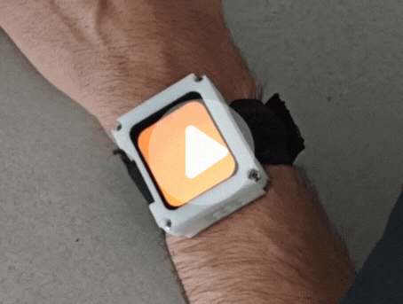](https://unizares-my.sharepoint.com/:v:/g/personal/822018_unizar_es/ETE9cXVVWytIuF3OWkDMDlkBq5lF2cOrpcbJai9p8g5TBA?e=Sftse4)

*Click on the thumbnail to watch the full video.*

Or download the video here:
[▶️ Download detection video (MP4)](https://raw.githubusercontent.com/PabloSanzG/edge_impulse_falls/main/docs/FallDetectionDemo.mp4)

---

## **Try It Yourself (quick start)**

### **1. Clone the repo**

```
git clone https://github.com/howlab-unizar/edge_impulse_falls
cd edge_impulse_falls
```

### **2. Flash the firmware**

* Install PlatformIO or Arduino
* Export your EI model as an Arduino library
* Drop it into `/lib/`
* Flash to ESP32-S3

### **3. Run the detector**

* Strap device on wrist or foot
* Power on
* Move normally → detector stays green
* Simulate falls on padding → detector triggers red screen

---

## **What can be improved next**

* Add pressure sensors → “smart insole” version
* Better fall trimming with synced video
* Personalized models per user
* Cloud dashboard for caregivers
* Pre-impact detection (hard!)

---

## Author & Credits

* Developed by **Pablo Sanz, Alberto Gascón, Roberto Casas**
* Aragon Institute of Engineering Research, University of Zaragoza
* Built with **Edge Impulse**.


